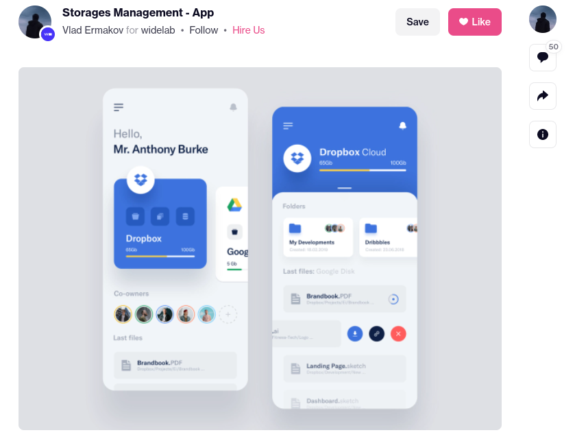
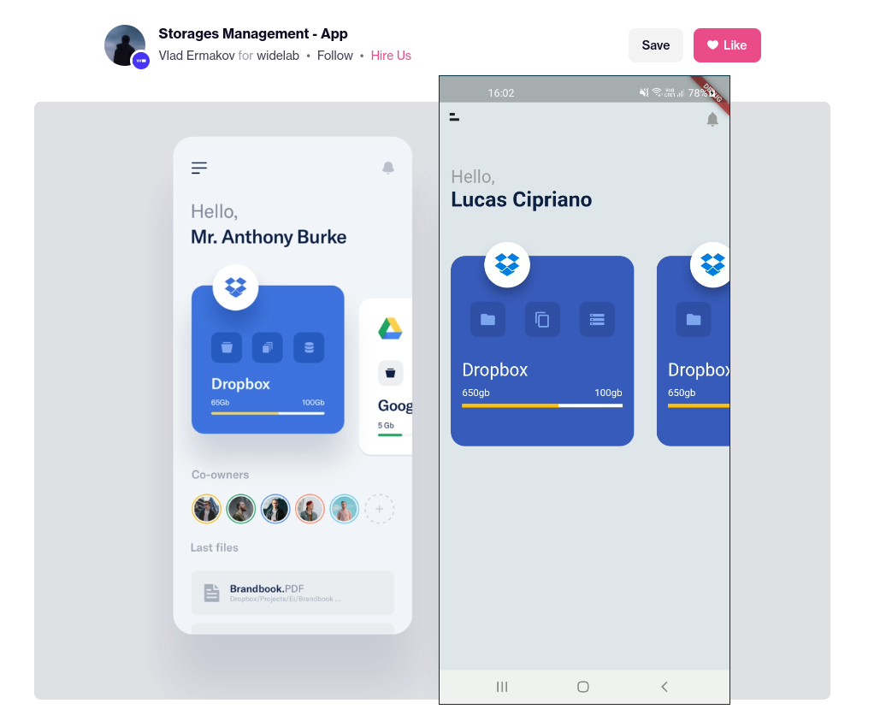
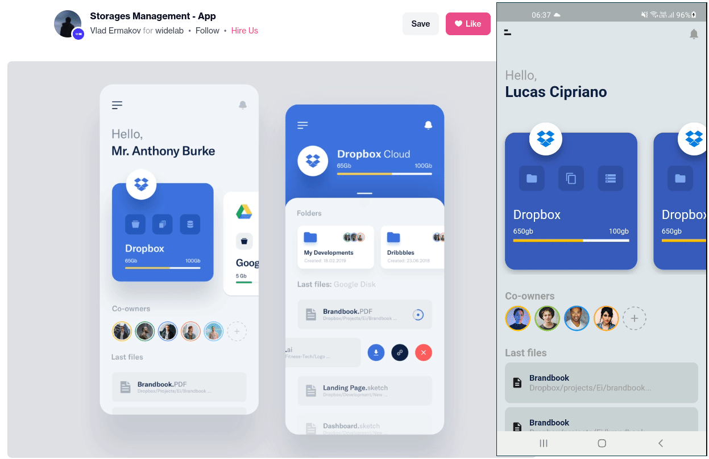

# Storage clone

Exercício UI clone com Flutter, não irei implementar por completo todas features que contém no protótipo, porém o ideal é adicionar o necessário para ser parecido.

Você pode [acessar](https://dribbble.com/shots/6794395-Storages-Management-App/) aqui, caso queira conhecer o projeto completo.

## Primeiro dia

## Finalizado primeira parte

